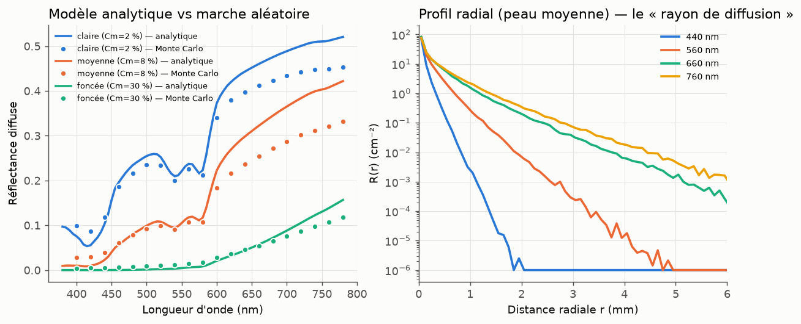
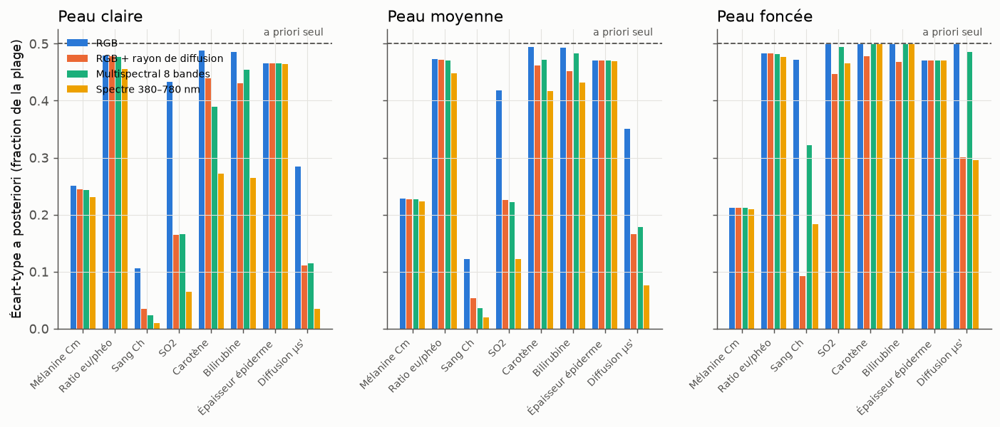
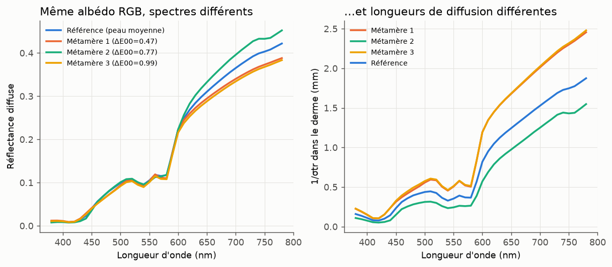

# Axe de recherche proposé

## Identifiabilité et acquisition des chromophores : que peut-on vraiment retrouver, et avec quelle mesure ?

### 1. Motivation

Les méthodes récentes, dont Aliaga & Jarabo (2026), prédisent des paramètres spectraux
de SSS à partir d'un **seul albédo RGB**. C'est très pratique pour la production, mais
le problème inverse est sous-déterminé. Ce qui n'est pas dans la mesure vient de
l'a priori des données d'entraînement. Avant d'améliorer les réseaux, il faut quantifier
trois choses :

1. **quels chromophores** sont réellement observables depuis quelle mesure ;
2. **quelle information minimale** faut-il ajouter au RGB (bandes spectrales, rayon de
   diffusion, polarisation) pour lever les ambiguïtés utiles au rendu ;
3. **comment obtenir cette information** à moindre coût, puis l'utiliser comme vérité
   terrain ou comme a priori pour les inversions RGB.

### 2. Hypothèses de travail

- **H1** : depuis le RGB seul, on identifie correctement la mélanine totale et le volume
  sanguin (peaux claires à moyennes). SO₂, carotène, bilirubine, ratio eu/phéo et
  épaisseur de l'épiderme ne sont pas identifiables.
- **H2** : ajouter une mesure du **rayon de diffusion** par canal (profil radial R(r),
  SFDI, lumière structurée) rend le μs′ et le volume sanguin identifiables, même sur
  peau foncée. Sur peau foncée, ce gain dépasse celui d'une caméra multispectrale
  8 bandes.
- **H3** : le biais du modèle direct (diffusion analytique vs random walk) est du même
  ordre que les erreurs d'inversion rapportées. Les données d'entraînement doivent donc
  être générées par Monte Carlo, avec la même marche aléatoire que le renderer.

### 3. Premiers résultats (prototype de ce dépôt)

Modèle : deux couches à la Donner & Jensen (2006), hémoglobine de Prahl, lois de
Jacques. Le modèle rapide est analytique (épiderme filtrant + dipôle) ; la référence est
une marche aléatoire Monte Carlo (HG, g = 0,8, Fresnel n = 1,4).
Scripts : `scripts/validate_forward_model.py` et `scripts/identifiability.py`.

**a) Biais du modèle analytique par rapport au Monte Carlo** (H3). Écart relatif sur
400–780 nm, 10⁵ photons par longueur d'onde :

| Peau | Écart moyen | Écart max |
|---|---|---|
| claire (Cm = 2 %) | 12 % | 36 % |
| moyenne (Cm = 8 %) | 24 % | 68 % |
| foncée (Cm = 30 %) | 51 % | 100 % |

Le modèle analytique surestime la réflectance dans le rouge (derme fini de 2 mm dans
le MC, épiderme non diffusant dans le modèle analytique) et se trompe fortement dans le
bleu sur peau foncée. Un décodeur entraîné sur ce modèle hériterait de ces biais.

**b) Identifiabilité locale (Cramér-Rao)**. Écart-type a posteriori, en fraction de la
plage plausible du paramètre. La valeur 0,50 correspond à l'a priori seul : la mesure
n'apporte rien.

| Peau moyenne | Cm | eu/phéo | Ch (sang) | SO₂ | Carotène | Bilirubine | Ép. épiderme | μs′ |
|---|---|---|---|---|---|---|---|---|
| RGB | 0,23 | 0,47 | **0,12** | 0,42 | 0,49 | 0,49 | 0,47 | 0,35 |
| RGB + rayon de diffusion | 0,23 | 0,47 | **0,05** | 0,23 | 0,46 | 0,45 | 0,47 | **0,17** |
| Multispectral 8 bandes | 0,23 | 0,47 | 0,04 | 0,22 | 0,47 | 0,48 | 0,47 | 0,18 |
| Spectre 380–780 nm | 0,22 | 0,45 | 0,02 | 0,12 | 0,42 | 0,43 | 0,47 | 0,08 |

| Peau foncée | Cm | eu/phéo | Ch (sang) | SO₂ | Carotène | Bilirubine | Ép. épiderme | μs′ |
|---|---|---|---|---|---|---|---|---|
| RGB | 0,21 | 0,48 | 0,47 | 0,50 | 0,50 | 0,50 | 0,47 | 0,50 |
| RGB + rayon de diffusion | 0,21 | 0,48 | **0,09** | 0,45 | 0,48 | 0,47 | 0,47 | **0,30** |
| Multispectral 8 bandes | 0,21 | 0,48 | 0,32 | 0,49 | 0,50 | 0,50 | 0,47 | 0,48 |
| Spectre 380–780 nm | 0,21 | 0,48 | 0,18 | 0,47 | 0,50 | 0,50 | 0,47 | 0,30 |

Lecture :
- Sur peau foncée, **le RGB ne dit rien du derme** (sang, SO₂, diffusion). Même un
  spectre complet reste faible. En revanche, **le rayon de diffusion** divise par 5
  l'incertitude sur le sang. H2 est confirmée dans ce modèle.
- Cm, épaisseur de l'épiderme et ratio eu/phéo restent coincés vers 0,2–0,47 quelle que
  soit la mesure. Dans ce modèle, l'épiderme est un filtre de Beer-Lambert : seul le
  produit Cm × épaisseur, avec une pente spectrale commune, est observable. Il faut
  vérifier par Monte Carlo si la diffusion épidermique lève cette dégénérescence.
- Carotène et bilirubine sont invisibles aux concentrations physiologiques, sauf en
  spectral sur peau claire (et encore faiblement).

**c) Métamères RGB**. Sur 30 000 peaux tirées au hasard, 70 ont le même albédo que la
peau moyenne de référence (ΔE₀₀ < 1). Elles couvrent 97 % de la plage de μs′, 97 % de
celle de SO₂ et 69 % de celle de la mélanine. Leur longueur de diffusion dans le rouge
varie d'un facteur 1,6 environ : même couleur, mais translucidité différente au rendu.

### 4. Programme proposé

| Étape | Contenu | Livrable |
|---|---|---|
| **A. Modèle direct de référence** | Monte Carlo multicouche (5 couches : SC, épiderme, derme papillaire, plexus, derme réticulaire), épiderme diffusant, spectres tabulés carotène/bilirubine (PhotochemCAD), eau/lipides pour le NIR | Générateur de données « vérité » + surrogate rapide (réseau ou LUT) validé contre MC |
| **B. Identifiabilité globale** | Au-delà de Cramér-Rao local : échantillonnage de la postérieure (MCMC / flots normalisants) par type de mesure, sur toute l'échelle de Fitzpatrick / Monk | Carte « mesure → paramètres identifiables », incertitudes par ton de peau |
| **C. Acquisition low-cost** | Banc : caméra monochrome + LEDs étroites (8–12 bandes) + polarisation croisée + projecteur (SFDI 2 fréquences) → cartes μa(λ), μs′(λ) → cartes de chromophores | Protocole + petit jeu de données avec vérité terrain spectro (comparaison NIST / Hyper-Skin) |
| **D. A priori appris** | Distribution conjointe des chromophores (à partir de C et des bases publiques) utilisée pour régulariser l'inversion RGB | Inversion RGB → (chromophores, incertitude) plutôt qu'un point estimé |
| **E. Retour au rendu** | Chromophores → μa(λ), μs(λ), g par couche → random walk spectral multicouche. Comparaison avec le mélange de 3 milieux d'Aliaga & Jarabo : erreur sur R(r), temps de rendu | Évaluation quantitative, profils radiaux mesurés vs rendus |

### 5. Cadrage retenu

Cible : **rendu de production** de digital doubles, à partir d'albédos calibrés
(VFace), avec un moteur spectral hero wavelength en shade-before-hit. Le pipeline
détaillé, les résultats propres à ce contexte et les prochaines étapes sont dans
[`PRODUCTION.md`](PRODUCTION.md).
