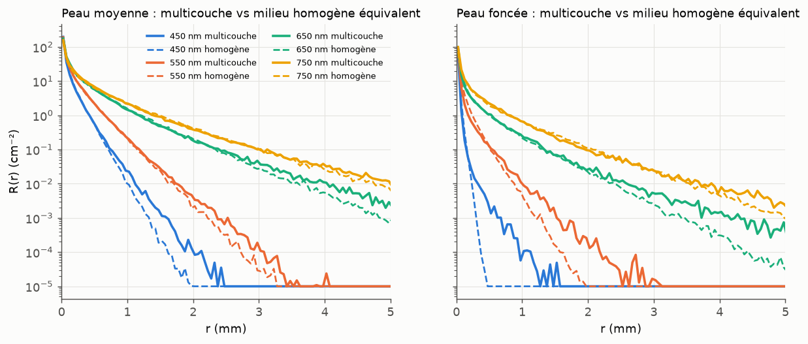
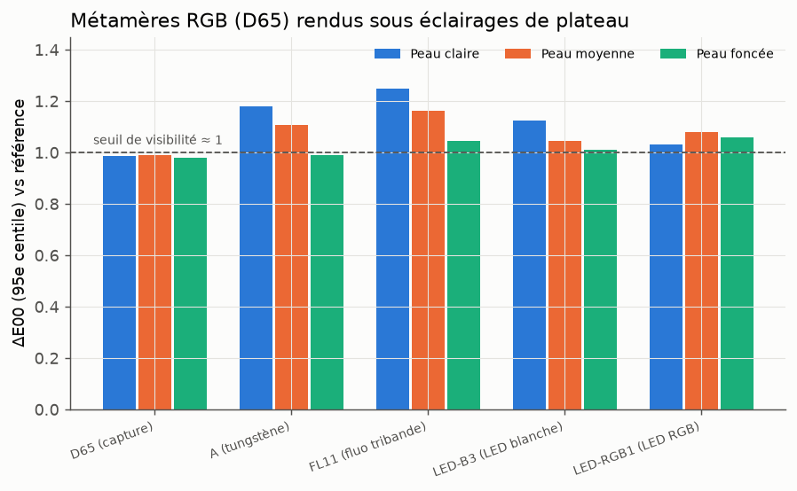

# Cible production : digital double, albédo VFace, moteur spectral shade-before-hit

## 1. Contexte

| Élément | Hypothèse de travail |
|---|---|
| Usage | Rendu de production de digital doubles |
| Données | Albédo diffus calibré (TexturingXYZ VFace) : photogrammétrie en milieu contrôlé, supposée en polarisation croisée (à confirmer). Plus rarement, relevé spectral ponctuel (cas Weta, *Gemini Man*) |
| Moteur | Maison, spectral *hero wavelength* (Wilkie et al. 2014), architecture shade-before-hit inspirée de Manuka (Fascione et al. 2018, TOG) |

### Conséquences pour la représentation

En shade-before-hit, les paramètres de matériau sont évalués au dicing et stockés par
vertex de micropolygone. La dépendance spectrale n'est évaluée qu'au hit, aux 4
longueurs d'onde du chemin. Il faut donc une représentation **compacte par vertex** et
**évaluable à n'importe quel λ**. Les chromophores répondent aux deux contraintes :

- **par vertex** : 5–6 scalaires (Cm, βm, Ch, SO₂, échelle de μs′, épaisseur
  d'épiderme), stockables en half-float. C'est l'équivalent de 2 textures RGB.
- **au hit** : μa(λ) est analytique (lois de puissance), plus une LUT 1D pour
  l'hémoglobine (≈ 190 valeurs). Il n'y a pas de uplifting RGB → spectre
  (Jakob & Hanika 2019) à faire pour le SSS : le spectre *est* le modèle physique.
- **contrôle artistique** : les paramètres ont un sens. Rougeur = Ch↑. Teinte
  froide/cyanosée = SO₂↓. Bronzage = Cm↑, et βm donne la teinte de la mélanine.
  Translucidité = μs′. On règle directement ces paramètres au lieu d'un rayon RGB
  ajusté à la main.

## 2. Pipeline proposé

```
 OFFLINE (texture)                 DICING (shade)             HIT (hero λ ×4)
 ────────────────────              ──────────────             ──────────────────────────────
 albédo VFace (RGB calibré)        chromophores/vertex  ──►   μa_epi(λ), μa_derm(λ), μs′(λ)
   │ calibration caméra (skin)     (5–6 half)                  │ 3 nombres sans dimension
   ▼                                                          ▼  (τ_e, μa_d/μs′, d_e·μs′)
 inversion par texel  ───────►                                LUT 3D (~8 Ko) → A, r̄
   + a priori (par acteur)                                     │ inversion par moments (LUT 1D)
   + gain (AO résiduel)                                        ▼
   + carte d'incertitude                                      σs(λ), σa(λ), g → random walk
```

### 2.1 Homogénéisation sans réseau (`chromophores/homogenize.py`)

À λ fixé, avec des couches de même indice et de même diffusion, et un derme
semi-infini, la réponse diffuse de la peau bicouche ne dépend que de **trois nombres
sans dimension** :

- τ_e = μa,épi · d_épi (épaisseur optique d'absorption de l'épiderme) ;
- μa,derme / μs′ ;
- d_épi · μs′ (épaisseur de l'épiderme en libres parcours de transport).

Les longueurs varient en 1/μs′. Une table 3D précalculée **une seule fois** par Monte
Carlo (12 × 14 × 6 entrées, ≈ 5 min) donne donc l'albédo de diffusion multiple A et le
rayon moyen de sortie de **n'importe quelle peau, à n'importe quel λ**. Elle ne dépend
ni des spectres des chromophores ni d'un jeu d'entraînement. On en tire ensuite
(α, σt) d'un milieu homogène de random walk ayant le même A et le même rayon moyen.
C'est une généralisation par moments de l'*albedo inversion* de Chiang et al. (2016).

C'est l'alternative déterministe au décodeur neuronal d'Aliaga & Jarabo. Elle est
exacte à la discrétisation près, et naturellement par longueur d'onde, ce qui
convient au hero wavelength.

**Précision de la table** (40 couples peau/λ aléatoires contre un Monte Carlo direct à
10⁵ photons) :

| Grandeur | Erreur médiane | p90 | max |
|---|---|---|---|
| Albédo multiple A | 2,0 % | 5,5 % | 13,3 % |
| Rayon moyen de sortie | 0,8 % | 4,4 % | 11,7 % |

**Milieu homogène équivalent vs peau multicouche** (écart L1 sur r·R(r)) :

| Peau | 450 nm | 550 nm | 650 nm | 750 nm |
|---|---|---|---|---|
| moyenne | 9 % | 5 % | 9 % | 10 % |
| foncée | 13 % | **38 %** | 14 % | 12 % |



Un seul milieu homogène reproduit bien A et le rayon moyen, mais il **sous-estime la
queue lointaine** de R(r). Les photons qui ont voyagé loin dans le derme ne traversent
l'épiderme absorbant qu'une fois de plus, ce que le milieu homogène ne capture pas.
L'écart est maximal sur peau foncée dans le vert. C'est exactement ce qui motive le
mélange de milieux d'Aliaga & Jarabo. Suite naturelle : ajouter un 2ᵉ moment (⟨r²⟩)
à la table et ajuster un **mélange de 2 milieux** par moments, toujours sans réseau.

### 2.2 Transport spectral

Sur une peau moyenne, 1/σt varie d'un facteur 2 environ entre 450 et 750 nm
(0,047 → 0,100 mm). L'échantillonnage des distances avec le σt de la longueur d'onde
héroïque, puis la pondération des 3 autres par ratio de densités (MIS spectral /
*spectral tracking*, Kutz et al. 2017), reste donc bien conditionné. À mesurer dans le
moteur : la variance supplémentaire par rapport à un rendu RGB.

## 3. Ce que dit la capture VFace (albédo seul)

### 3.1 Calibration caméra (`scripts/production_metamerism.py`)

Modèle : capteur Nikon D5100 (sensibilités spectrales mesurées NPL), illuminant D65,
matrice 3×3 caméra → XYZ ajustée par moindres carrés. Évaluation sur 4 000 spectres de
peau simulés :

| Calibration | ΔE00 médian | p95 | max |
|---|---|---|---|
| ColorChecker 24 | 2,41 | 3,95 | 4,48 |
| Spectres de peau | 0,38 | 2,04 | 3,14 |

Une calibration sur mire générique laisse une erreur **visible** sur la peau, du même
ordre que les écarts entre chromophores que l'on cherche. Deux options : calibrer sur
des spectres de peau, ou mieux, intégrer les sensibilités de la caméra dans le modèle
direct de l'inversion.

### 3.2 Métamérisme d'illuminant

Une inversion RGB renvoie une peau parmi toutes celles qui ont le même albédo sous D65.
Rendus sous des éclairages de plateau, ces métamères restent proches de la référence :

| Peau | # métamères | D65 | A | FL11 | LED blanche | LED RGB |
|---|---|---|---|---|---|---|
| claire | 137 | ≤ 1,00 | ≤ 1,48 | ≤ 1,62 | ≤ 1,33 | ≤ 1,28 |
| moyenne | 89 | ≤ 1,00 | ≤ 1,28 | ≤ 1,24 | ≤ 1,15 | ≤ 1,23 |
| foncée | 101 | ≤ 1,00 | ≤ 1,10 | ≤ 1,09 | ≤ 1,03 | ≤ 1,24 |

(ΔE00 maximal par rapport à la peau de référence.)



**La couleur diffuse est donc bien contrainte par le RGB, même sous LED.** Ce qui ne
l'est pas, c'est la **translucidité**. Les mêmes métamères couvrent 97 % de la plage de
μs′, et leur longueur de diffusion varie d'un facteur 1,6 (voir `AXE_DE_RECHERCHE.md`).
Dans ce cadre, l'a priori de l'inversion décide du *look SSS*, pas de la couleur.

### 3.3 Ombrage résiduel dans l'albédo

On modélise l'occlusion ou les cavités restées dans l'albédo, ou une erreur
d'exposition, par un gain achromatique inconnu (0,6–1,0). Écart-type a posteriori,
0,5 = a priori seul :

| Peau moyenne | Cm | Ch (sang) | SO₂ | μs′ | gain |
|---|---|---|---|---|---|
| RGB (gain connu) | 0,23 | 0,12 | 0,42 | 0,35 | — |
| RGB + gain inconnu | 0,23 | 0,13 | 0,48 | **0,46** | 0,28 |
| Spectre + gain inconnu | 0,22 | 0,05 | 0,13 | 0,41 | 0,18 |

Un gain inconnu est **confondu avec la diffusion** : un albédo plus sombre peut venir
d'une occlusion ou d'un μs′ plus faible. Le sang et la mélanine restent robustes. Il
faut donc retirer l'occlusion avant l'inversion (AO calculée depuis le déplacement
VFace) ou marginaliser le gain, sinon la carte de translucidité absorbe les cavités.

## 4. Recommandations et prochaines étapes

1. **Inverser vers 3 paramètres robustes plus un a priori explicite.** Depuis le RGB
   VFace, on peut estimer Cm (avec βm) et Ch par texel. SO₂, carotène, épaisseur et μs′
   doivent venir d'un **a priori par acteur**, pas d'un a priori universel appris.
2. **Mesure additionnelle la plus rentable : la translucidité.** Quelques mesures
   ponctuelles par acteur suffisent : front, joue, nez, lèvre, oreille, avec un
   spectrophotomètre et un profil radial (spot laser/LED ou SFDI). Elles fixent μs′ et
   calibrent l'a priori. C'est l'équivalent léger du relevé spectral de *Gemini Man*.
3. **Calibration caméra orientée peau**, ou modèle direct avec les sensibilités de la
   caméra.
4. **Mélange de 2 milieux par moments**, à partir d'une table étendue (A, ⟨r⟩, ⟨r²⟩),
   pour corriger la queue lointaine sur peau foncée. À comparer au random walk
   réellement multicouche (épiderme comme coque mince) en coût et en qualité.
5. **Filtrage des cartes de chromophores.** La réflectance n'est pas linéaire en Cm
   ni en Ch. Mipmapper les paramètres biaise la couleur moyenne (taches de rousseur,
   pores, barbe). Piste : filtrer dans l'espace des épaisseurs optiques (τ_e, Ch·d),
   où l'absorption est linéaire, et mesurer le biais.
6. **Table plus fine** : erreur max de 13 % à 12×14×6 points, et plus de photons dans
   les zones peu réfléchissantes.

## 5. Questions ouvertes

- L'albédo VFace est-il bien en polarisation croisée ? Connaît-on la caméra et la
  chaîne de calibration (mire, espace colorimétrique de sortie) ?
- Les cartes *utility* de VFace (masques de zones) sont-elles disponibles ? On pourrait
  s'en servir pour des a priori par région (lèvres, paupières, zone de barbe).
- Le moteur supporte-t-il déjà un random walk à σt chromatique par longueur d'onde
  héroïque, ou faut-il ajouter le spectral tracking ?
