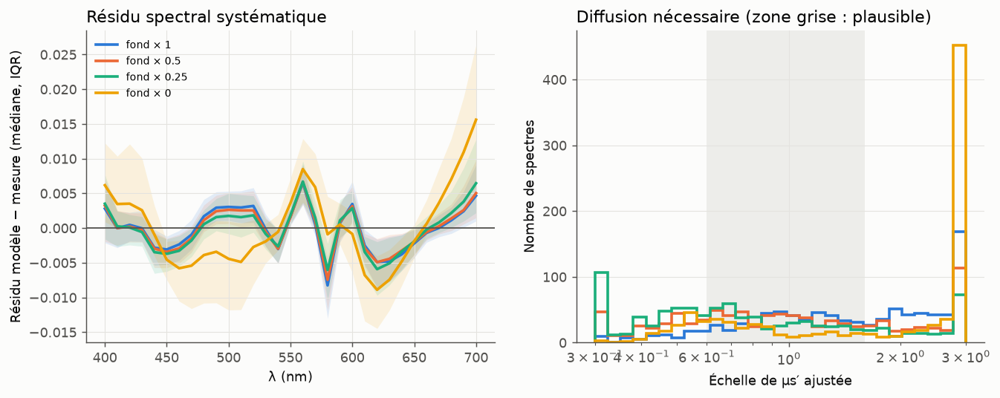
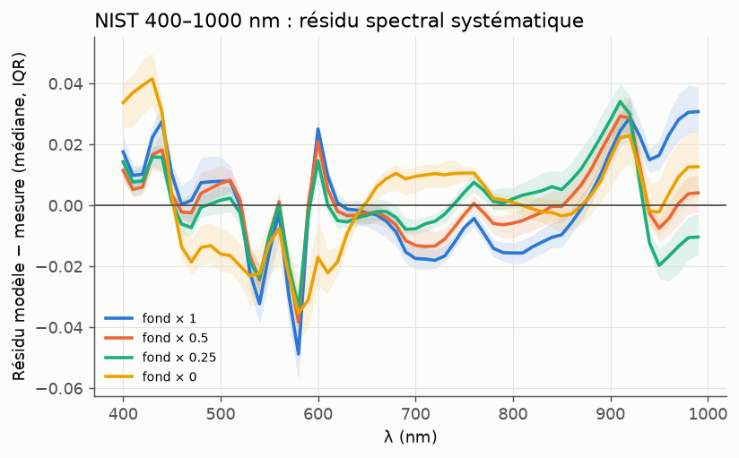

# Ancrage sur des mesures réelles : ISSA et NIST

Date : 2026-09-25. Rapports détaillés : [ISSA_BASELINE](ISSA_BASELINE.md),
[NIST_BASELINE](NIST_BASELINE.md), [PACKAGING_STUDY](PACKAGING_STUDY.md).

## Données

| Jeu | Contenu | Géométrie | Chargeur |
|---|---|---|---|
| **ISSA** (Leeds Skin Database, 2025) | 15 256 spectres, 2 107 sujets, 8 groupes ethniques, 12 zones du corps (≈ 7 500 sur le visage) ; 400–700 nm (et 360–740 pour un tiers), pas de 10 nm | Spectrophotomètre, SCI (spéculaire inclus) | `chromophores.datasets.load_issa` |
| **NIST** (Cooksey et al. 2017) | 100 sujets, face intérieure de l'avant-bras, 250–2500 nm / 3 nm, 3 répétitions | Sphère intégrante, directionnel-hémisphérique (spéculaire inclus) | `chromophores.datasets.load_nist` |

Modèle de mesure : R_mesuré = R_sp + (1 − R_sp)·A, avec R_sp = 2,8 % (Fresnel, n = 1,4).

## Question : quelle absorption de fond ?

Protocole : chaque spectre est ajusté par le modèle phase 1, avec 6 paramètres libres
(mélanine, β, sang, SO₂, épaisseur, échelle de μs′ ∈ [0,3 ; 3]) et plusieurs départs,
pour 4 niveaux de fond (Jacques × 1, 0,5, 0,25 et 0, ce dernier étant proche de
BioSkin). Un fond faux ne peut être compensé que par une diffusion irréaliste : on
regarde donc la qualité d'ajustement **et** la diffusion requise.

| Fond | ISSA (960 spectres, 400–700) : RMS / μs′ médian | NIST 400–700 : RMS / μs′ | NIST 400–1000 : RMS / μs′ / % μs′ hors [0,6 ; 1,6] |
|---|---|---|---|
| Jacques × 1 | 0,0047 / 1,49 | 0,0059 / 3,00 (butée) | 0,0179 / 1,60 / 50 % |
| **× 0,5** | **0,0046 / 0,95** | 0,0053 / 2,21 | **0,0131 / 0,96 / 3 %** |
| × 0,25 | 0,0049 / 0,70 | 0,0053 / 1,31 | 0,0137 / 0,80 / 12 % |
| × 0 (≈ BioSkin) | 0,0077 / 2,63 (butée pour 43 %) | 0,0079 / 0,92 | 0,0188 / 1,08 / 12 % |

**Conclusion.** Les deux jeux indépendants convergent : **la moitié du fond de
Jacques** ajuste le mieux les vraies peaux, *avec la diffusion nominale de Jacques*
(échelle ≈ 0,95).
- Le fond de Jacques complet oblige à gonfler μs′ de 50 % (ISSA), voire à le mettre en
  butée (NIST visible). Il ne peut d'ailleurs pas produire les peaux les plus claires
  mesurées : 0,52 au mieux contre 0,63–0,65 mesurés en diffus à 650–750 nm.
- L'absence de fond (type BioSkin) donne les **pires** ajustements, sauf pour les peaux
  africaines, où la mélanine domine.

Sur NIST visible, l'échelle de μs′ est mal contrainte : le proche infrarouge est
nécessaire pour la fixer, ce qui est cohérent avec l'analyse d'identifiabilité.

## Défauts structurels révélés (communs à toutes les options de fond)

1. **Bandes de l'hémoglobine trop contrastées** : modèle trop sombre à 540 et 580 nm,
   trop clair à 560 et 600 nm. C'est aussi ce qui distingue notre modèle de BioSkin.
   *Hypothèse testée et rejetée* : l'empaquetage vasculaire (van Veen 2002) dégrade
   les ajustements quel que soit le rayon (10–100 µm). Pistes restantes : répartition
   du sang en profondeur (plexus papillaire, 3ᵉ couche), bande passante des
   instruments, SO₂ par couche.
2. **Proche infrarouge 850–930 nm trop clair**, puis écart autour de la bande de l'eau
   à 970 nm : il manque l'absorption des **lipides** (pic à 930 nm), et la fraction
   d'eau est à revoir.
3. **400–440 nm (bande de Soret)** : léger excès du modèle.

## Portée pour la production

- Le RMS médian de 0,0046 en visible correspond à un ΔE00 typiquement < 1 :
  **le modèle ajuste la couleur des vraies peaux**, sur les 8 groupes, visage et corps.
- Ces mesures sont en réflectance totale. Elles ne disent rien du profil radial
  (translucidité), qui reste à valider (V5, mesures ponctuelles).
- Les deux jeux servent aussi pour la phase 2 : l'**a priori de population** (bayésien
  empirique) peut être construit sur les paramètres ajustés d'ISSA (≈ 15 000 spectres,
  par groupe et par zone), directement en espace chromophores.
