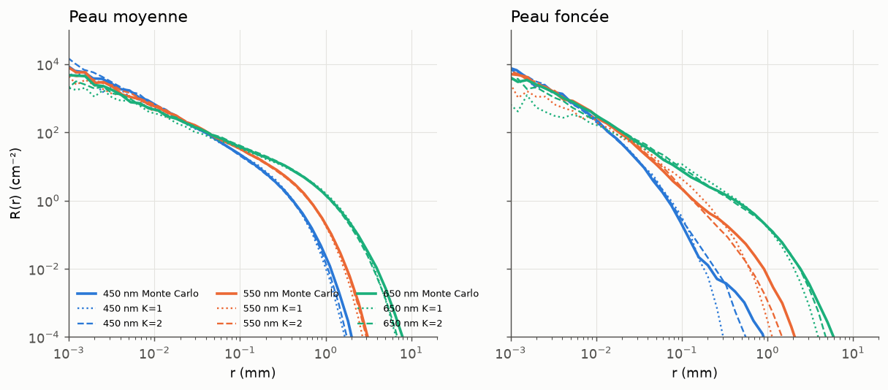

# Phase 1 — Modèle direct : bilan

Date : 2026-09-25. Cadre : [ADR-0001](../adr/0001-separer-direct-et-inverse.md),
[ADR-0002](../adr/0002-modele-direct-table-sans-dimension.md),
[ADR-0005](../adr/0005-validation-et-criteres.md), et ajustements proposés dans
[ADR-0006](../adr/0006-ajustements-phase1.md).

Rapports détaillés générés par les scripts : [V1](V1_table.md), [V2](V2_mixture.md),
[V2b](V2b_aliaga_tones.md), [diagnostic V2b](V2b_diagnostic.md).

## 1. Livrables

| Livrable | Fichier | Remarques |
|---|---|---|
| Modèle de peau phase 1 | `chromophores/optics.py` (`SkinModel`) | g(λ) = 0,62 + 0,00029·λ, eau (Segelstein) dans le derme à 65 %, 250–1000 nm. `SkinModel.legacy()` reproduit le prototype |
| Données eau | `chromophores/data/water_segelstein.csv` | Segelstein 1981 / Hale & Querry 1973 (refractiveindex.info, CC0) |
| Monte Carlo | `chromophores/montecarlo.py` | Bins radiaux arbitraires (log), moments ⟨r⟩ et ⟨r²⟩ |
| Vérification analytique | `chromophores/adding_doubling.py` | Adding-doubling bicouche (`iadpython`) ; accord avec le MC : 0,2 % médian, 1 % p95 |
| Table multicouche 4D | `chromophores/table.py`, `data/layered_table_v1.npz` (1,3 Mo) | 12×14×7×4 = 4 704 cellules, 3·10⁴ photons chacune, 36 min sur 4 cœurs ; build par tranches, reprenable (farm) |
| LUT homogène (α, g) | `chromophores/homogeneous_lut.py`, `data/homogeneous_lut_v2.npz` | 48×8, α ∈ [0,001 ; 1 − 2·10⁻⁵], 11 min |
| Fit du mélange K=1 / K=2 | `chromophores/mixture.py`, `data/mixture_fit_v2.npz` | g partagé, 3 passes de lissage rouge-noir, 11 min sur 4 cœurs |
| Modèle direct de référence | `chromophores/forward.py` | Chromophores + λ héroïques → albédo et mélange (α_k, g, σt,k, w_k), avec correction d'albédo |
| Scripts | `scripts/phase1/` | `build_tables.py`, `fit_mixture.py`, `v1_table.py`, `v2_mixture.py`, `v2b_aliaga_tones.py`, `v2b_diagnostic.py` |

## 2. Résultats contre les critères (ADR-0005)

| Niveau | Mesure | Résultat | Critère | Statut |
|---|---|---|---|---|
| V1 | A table vs MC (196 couples, 250–1000 nm) | médiane 0,46 %, p95 2,43 % | < 1 % / < 3 % | ✅ |
| V1 | ⟨ρ⟩, ⟨ρ²⟩ table vs MC | p95 5,3 % / 6,0 % | p95 < 5 % | ❌ (de peu) |
| V2 | ΔE00 albédo du mélange vs MC (12 peaux, spectre 380–780) | médiane 0,24, max 0,44 | < 0,5 | ✅ |
| V2 | Forme du profil, mélange interpolé vs MC (60 couples) | RMSE énergie médiane 0,15, p95 0,62 ; plancher de bruit 0,036 / 0,084 | p95 < 0,05 (ou écart au plancher < 0,05) | ❌ |
| V2b | 10 tons d'Aliaga & Jarabo | ΔE00 médian 10,2 | < 2 | ❌ (écart de modèle, voir §3.4) |

**Gain de K=2 sur K=1** (contrôle indépendant, RMSE énergie médiane) : de 0,39 à 0,15,
soit 2,6 fois moins d'erreur. Sur les cellules elles-mêmes : de 0,30 à 0,12. Ça
confirme le résultat principal d'Aliaga & Jarabo : un seul milieu ne suffit pas.

## 3. Enseignements

1. **Convention de réflectance.** Nos tables donnent A par photon transmis. L'écart
   systématique de −2,8 % avec l'adding-doubling venait uniquement de la transmission
   de Fresnel à l'entrée. Albédo caméra = (1 − R_sp)·A.
2. **À μs′ fixé, A dépend très peu de g** (similarité). g ne joue que sur la forme du
   profil en champ proche. C'est ce qui rend le mélange à g partagé acceptable
   (ADR-0006).
3. **Les paramètres du mélange sont multimodaux.** Chaque cellule est bien ajustée, mais
   l'interpolation multilinéaire des paramètres donnait 3 à 37 % d'erreur d'albédo. Trois
   corrections ont été apportées (g partagé, lissage, correction d'albédo) : la couleur
   est maintenant exacte par construction, et l'erreur non corrigée aux points milieux
   est descendue à 0,5–2,7 % médiane. **La forme du profil reste la limite** : environ
   4× le plancher de bruit en médiane, avec une queue de distribution lourde (peaux
   foncées, bleu et vert, queue lointaine < 10⁻³ du pic).
4. **Interpolation de la table.** Avec la résolution prototype, l'interpolation
   multilinéaire ne passait pas V1 (p95 5,4 %). PCHIP en tenseur divise l'erreur par 2 à
   3, pour un coût nul en données. Les axes τ_e et d_e dominent l'erreur : c'est là qu'il
   faut densifier la grille.
5. **Aliaga & Jarabo ne sont pas reproductibles avec leurs seuls paramètres publiés.**
   À paramètres identiques, notre peau est plus grise et plus sombre (ΔE00 ≈ 10). Sans
   absorption de fond (Jacques 7,84·10⁸ λ⁻³·²⁵⁵), l'écart tombe à ≈ 5. D'autres
   différences restent (mélanine, sang, chromophores basaux, voire l'espace de leurs
   RGB). Il faut le détail du modèle d'Aliaga et al. 2023. **Notre modèle n'a pas été
   ajusté pour coller à leurs couleurs.**

## 4. Pistes pour les critères non atteints

| Problème | Pistes (par coût croissant) |
|---|---|
| Moments V1 (p95 ≈ 5–6 %) | Densifier τ_e et d_e ×1,5–2 (≈ ×3 en calcul, farm) |
| Forme du profil V2 | (a) 10× plus de photons (farm) pour des fits moins bruités et moins multimodaux ; (b) grille plus dense ; (c) g libre pour le 2ᵉ milieu seulement, avec lissage ; (d) juger la forme sur le rendu (V4) plutôt que sur une RMSE log, la queue < 10⁻³ du pic étant invisible |
| V2b | Récupérer le modèle d'Aliaga et al. 2023 (spectres, fond, diffusion) ; choisir la source de l'absorption de fond |

## 5. Suite

**Ce dont la phase 2 a besoin est validé.** L'inversion RGB → chromophores s'appuie
sur l'albédo, et l'albédo passe V1 et V2 (A et ΔE00).

**Ce qui n'est pas validé concerne la phase 3** (moteur) : la forme du profil, qui
dépend d'une table de production calculée sur la farm.

Proposition (à décider, cf. règle de blocage de l'ADR-0005) : **lancer la phase 2** en
parallèle de la production d'une table « farm » (plus de photons, grille densifiée sur
τ_e et d_e). Le critère de forme de V2 reste bloquant pour la phase 3.
