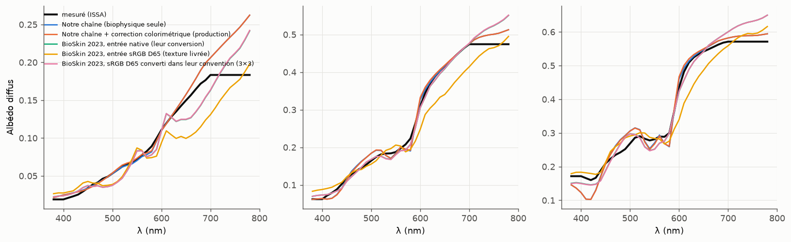
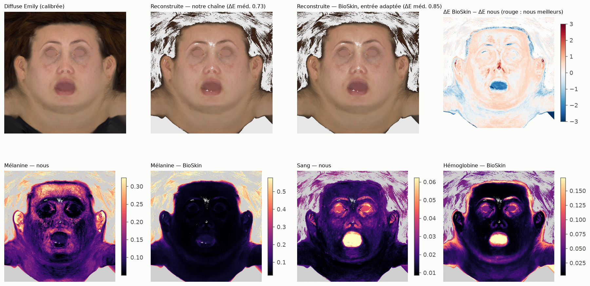

# Benchmark réflectance : notre chaîne vs BioSkin (Aliaga et al. 2023)

BioSkin est la base de la partie réflectance d'Aliaga & Jarabo 2026 (leur partie translucidité
n'est pas publiée). Décodeur et encodeur pré-entraînés (`BioSkin.pt`, MIT), exécutés en numpy.

## 1. Spectres ISSA mesurés, non utilisés pour nos a priori (300)

Référence : spectre **mesuré** (albédo diffus = SCI − R_sp). Chaque chaîne ne voit que le RGB.

| Chaîne | RMS spectral méd. / p95 (400–700) | ΔE00 D65 méd. / p95 | ΔE00 A méd. / p95 | ΔE00 FL11 méd. / p95 | ΔE00 LED-B3 méd. / p95 |
|---|---|---|---|---|---|
| Notre chaîne (biophysique seule) | 0.0094 / 0.0209 | 0.39 / 1.44 | 0.51 / 1.45 | 0.71 / 1.98 | 0.43 / 1.40 |
| Notre chaîne + correction colorimétrique (production) | 0.0094 / 0.0212 | 0.00 / 0.00 | 0.36 / 1.14 | 0.66 / 1.84 | 0.28 / 0.79 |
| BioSkin 2023, entrée native (leur conversion) | 0.0153 / 0.0337 | 0.77 / 1.12 | 0.86 / 1.40 | 1.34 / 2.52 | 0.91 / 1.43 |
| BioSkin 2023, entrée sRGB D65 (texture livrée) | 0.0379 / 0.0508 | 5.22 / 6.42 | 4.96 / 5.64 | 6.35 / 7.93 | 5.35 / 6.55 |
| BioSkin 2023, sRGB D65 converti dans leur convention (3×3) | 0.0153 / 0.0336 | 0.77 / 1.12 | 0.86 / 1.40 | 1.33 / 2.50 | 0.92 / 1.42 |

Fermeture dans leur propre convention (BioSkin natif, RGB reconstruit vs entrée) : erreur relative
médiane 3.2 %.

## 2. Digital Emily (diffuse cross-pol calibrée, 640²)

Albédo reconstruit à partir des paramètres estimés, comparé à l'entrée (sRGB D65), sur les texels peau :

| Chaîne | ΔE00 médiane | p90 | p95 | % < 1 | % < 2 |
|---|---|---|---|---|---|
| Notre chaîne (cartes seules, sans correction) | 0.73 | 2.06 | 2.80 | 65 % | 89 % |
| BioSkin 2023, entrée sRGB D65 brute | 5.40 | 6.31 | 6.54 | 0 % | 0 % |
| BioSkin 2023, entrée convertie dans leur convention (3×3) | 0.85 | 1.94 | 2.67 | 77 % | 91 % |

Remarque : les grandeurs « mélanine » et « hémoglobine » des deux modèles n'ont pas la même
définition ni la même échelle ; on compare leur structure spatiale, pas leurs valeurs.

## 3. Lecture

1. **Spectres (vs mesures ISSA)** : notre chaîne reconstruit des spectres **1,6× plus proches** de
   la mesure (RMS 0,0094 contre 0,0153 pour BioSkin dans ses meilleures conditions). Sous tous
   les éclairages, notre chaîne de production (avec correction colorimétrique) est la meilleure :
   ΔE00 médian sous A 0,36 contre 0,86 ; FL11 0,66 contre 1,33 ; LED 0,28 contre 0,92.
2. **La convention couleur de BioSkin est un piège d'intégration.** Sa conversion interne
   (illuminant E, matrice maison, BGR) n'est pas du sRGB D65. Une texture sRGB D65 injectée telle
   quelle donne ΔE00 ≈ 5 sur toutes les métriques (spectres 4× plus faux). Une conversion 3×3
   préalable, ajustée sur des spectres de peau, supprime entièrement ce biais. C'est très
   probablement la cause principale de la dérive de couleurs rencontrée avec l'ancien pipeline
   basé sur BioSkin.
3. **Reconstruction de l'albédo d'Emily (fermeture)** : à égalité, avec des profils d'erreur
   différents. Médiane : nous 0,73, BioSkin 0,85. Queue de distribution : BioSkin est légèrement
   meilleur (77 % des texels < 1 contre 65 % ; p95 2,67 contre 2,80). Notre chaîne a en plus la
   correction colorimétrique, qui ramène la fermeture à 0 par construction.
4. **Cartes** : l'hémoglobine a une structure spatiale proche dans les deux chaînes. La mélanine
   BioSkin est quasi plate sur le visage d'Emily, alors que la nôtre montre taches de rousseur et
   pigmentation péri-oculaire. Les définitions et les échelles diffèrent : c'est la structure qui
   se compare, pas les valeurs.

**Portée** : ce benchmark ne couvre que la réflectance. La translucidité d'Aliaga & Jarabo 2026
(mélange de 3 milieux prédit par réseau) n'est pas publiée et reste leur point d'avance.
