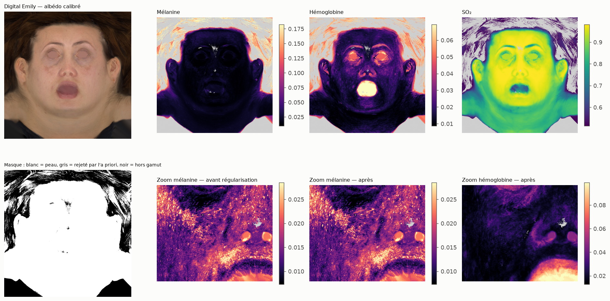
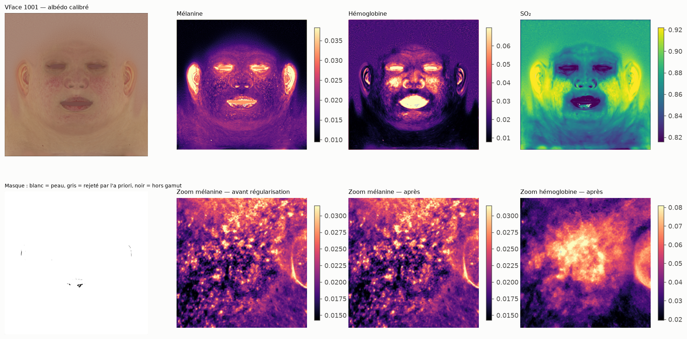

# Clôture de la phase 2 : pipeline albédo → chromophores

Module : `chromophores/pipeline.py` (`process_albedo`, `export`). Script : `scripts/phase2/close_phase2.py`
(`VFACE_RES=4096` pour la pleine résolution en local).

Étapes : auto-calibration → LUT 65³ (a priori visage) avec covariance complète par nœud →
masque non-peau (hors gamut, ou chromophores improbables sous l'a priori : distance de
Mahalanobis > χ²₆(99,9 %)) → régularisation guidée par l'incertitude des paramètres secondaires
(σ = 6 px, λ = 1 ; mélanine et sang gardés au MAP) →
modèle direct par texel → résidu couleur (3 coefficients) → export EXR.

| Asset | Résolution | Temps | Gains (R, G, B) | Gamut | Peau (après masque a priori) | Corr. mél./sang fine (σ 2 px) avant → après | Corr. mél./sang plaques (σ 16 px) avant → après | ΔE00 cartes seules avant → après régul. (méd. / p95) | Fermeture avec résidu (err. max) |
|---|---|---|---|---|---|---|---|---|---|
| Digital Emily | 1280×1280 | 140 s | (0.75, 0.75, 0.71) | 76 % | 76.4 % | -0.03 → -0.03 | -0.29 → -0.29 | 0.72 / 3.03 → 0.74 / 3.07 | 7.8e-16 |
| VFace 1001 | 1024×1024 | 91 s | (0.78, 0.78, 0.78) | 100 % | 99.9 % | +0.65 → +0.65 | +0.21 → +0.21 | 0.45 / 1.06 → 0.45 / 1.09 | 4.4e-16 |

- **Corrélations mélanine / sang** : entre log(mélanine) et log(sang), par bande spatiale
  (différence de gaussiennes σ / 4σ), sur l'extrait de joue (rougeurs de VFace).
- **ΔE00 cartes seules** : albédo recalculé depuis les cartes, sans résidu. Le résidu garantit
  dans tous les cas la fermeture exacte (dernière colonne, précision machine).

### Effet de la régularisation : écart-type haute fréquence après / avant (espace non borné)

| Asset | melanin_fraction | eumelanin_ratio | blood_fraction | oxygen_saturation | epidermis_thickness_cm | scattering_scale |
|---|---|---|---|---|---|---|
| Digital Emily | 1.00 | 0.34 | 1.00 | 0.42 | 0.81 | 1.05 |
| VFace 1001 | 1.00 | 0.45 | 1.00 | 0.54 | 0.84 | 1.18 |

## Constats

1. **La diaphonie mélanine / sang venait surtout d'une erreur de constante.** Avant la correction
   de la phéomélanine (10 fois trop faible, voir [PHEO_CHECK](PHEO_CHECK.md)), mélanine et sang
   étaient fortement anticorrélés à l'échelle des plaques (σ 16 px) : −0,49 sur VFace, −0,57 sur
   Emily. L'ajustement retirait de la mélanine dans les rougeurs pour compenser une mélanine de
   mauvaise forme spectrale. Avec la constante du papier, la corrélation passe à +0,21 sur VFace
   et −0,29 sur Emily (tableau ci-dessus) : l'essentiel de l'échange a disparu. Ce qui reste sur
   Emily est à surveiller, mais n'est plus un défaut majeur.
2. **La régularisation ne sert pas à corriger la diaphonie.** Une première version (régularisation
   de tous les paramètres, pondérée par la covariance) le montrait : diaphonie inchangée, mais
   25 % du détail fin de la mélanine perdu, ce qui est inacceptable pour les artistes. La version
   retenue **garde mélanine et sang au MAP par texel** (détail complet) et ne régularise que les
   paramètres mal contraints (ratio eu/phéo, SO₂, épaisseur, diffusion), conditionnellement aux
   premiers : cartes secondaires moins bruitées, sans toucher aux cartes principales. Seule
   exception : l'échelle de diffusion devient plus bruitée (elle absorbe ce que les autres cèdent).
   Elle n'est de toute façon pas identifiable depuis le RGB (corrélation 0,08, §2 du bilan) :
   **en production, utiliser une valeur constante (a priori) plutôt que la carte.**
3. **Le masque par l'a priori ne rejette presque rien** au-delà du gamut : la LUT tire déjà le MAP
   vers l'a priori, donc la distance de Mahalanobis reste faible. Le masque utile est le gamut
   (cheveux, yeux, intérieur de la bouche sur Emily).
4. **Pistes pour la diaphonie résiduelle** (Emily) : confinement du sang dans les vaisseaux
   (déjà testé, n'améliore pas les ajustements, voir PACKAGING_STUDY), sang du derme papillaire,
   ou validation contre une capture multispectrale.

## Fichiers exportés (EXR half, ZIP)

- `exports/emily/melanin.exr`
- `exports/emily/melanin_sigma.exr`
- `exports/emily/eumelanin_ratio.exr`
- `exports/emily/eumelanin_ratio_sigma.exr`
- `exports/emily/hemoglobin.exr`
- `exports/emily/hemoglobin_sigma.exr`
- `exports/emily/oxygenation.exr`
- `exports/emily/oxygenation_sigma.exr`
- `exports/emily/epidermis_thickness_cm.exr`
- `exports/emily/epidermis_thickness_cm_sigma.exr`
- `exports/emily/scattering_scale.exr`
- `exports/emily/scattering_scale_sigma.exr`
- `exports/emily/skin_mask.exr`
- `exports/emily/albedo_input_calibrated.exr`
- `exports/emily/albedo_from_maps.exr`
- `exports/emily/colour_residual_coeffs.exr`
- `exports/vface_1024/melanin.exr`
- `exports/vface_1024/melanin_sigma.exr`
- `exports/vface_1024/eumelanin_ratio.exr`
- `exports/vface_1024/eumelanin_ratio_sigma.exr`
- `exports/vface_1024/hemoglobin.exr`
- `exports/vface_1024/hemoglobin_sigma.exr`
- `exports/vface_1024/oxygenation.exr`
- `exports/vface_1024/oxygenation_sigma.exr`
- `exports/vface_1024/epidermis_thickness_cm.exr`
- `exports/vface_1024/epidermis_thickness_cm_sigma.exr`
- `exports/vface_1024/scattering_scale.exr`
- `exports/vface_1024/scattering_scale_sigma.exr`
- `exports/vface_1024/skin_mask.exr`
- `exports/vface_1024/albedo_input_calibrated.exr`
- `exports/vface_1024/albedo_from_maps.exr`
- `exports/vface_1024/colour_residual_coeffs.exr`

Cartes : mélanine, ratio eu/phéo, hémoglobine, oxygénation, épaisseur d'épiderme (cm), échelle de
diffusion, chacune avec son incertitude relative (`*_sigma`, ≈ σ relatif à 1 écart-type) ;
`skin_mask` ; `albedo_input_calibrated` ; `albedo_from_maps` (modèle seul) ;
`colour_residual_coeffs` (3 coefficients : spectre final = spectre des cartes × (1 + Bᵀc), B = lobes
des fonctions colorimétriques, voir `inversion.colour_exact`).
