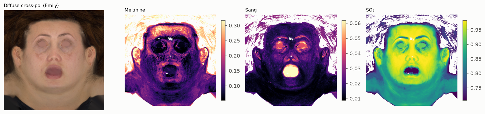
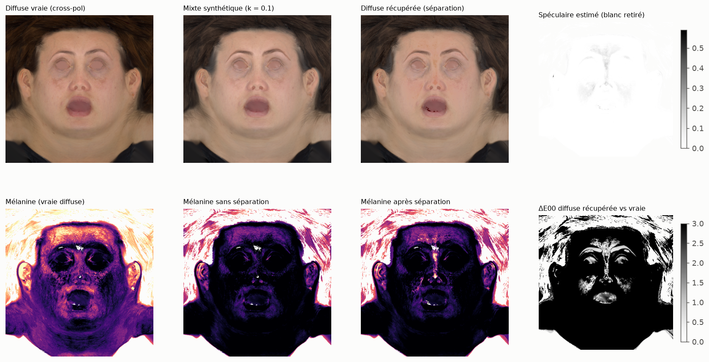
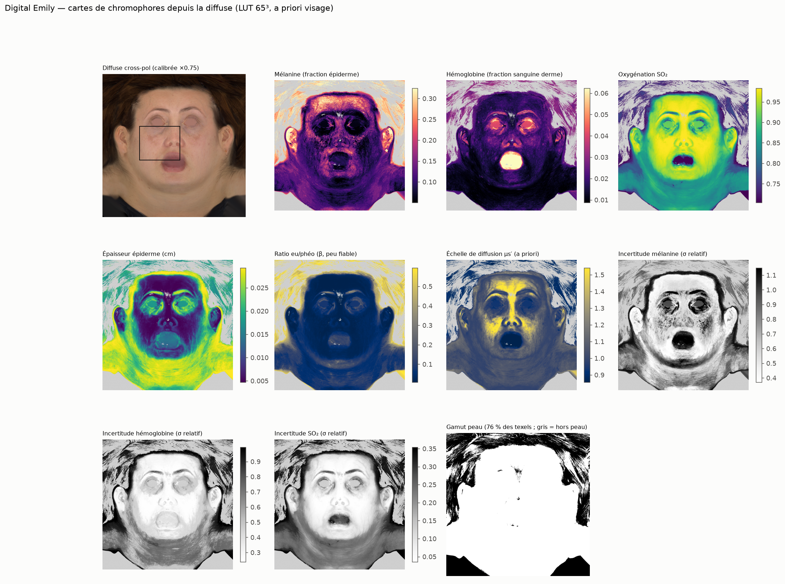
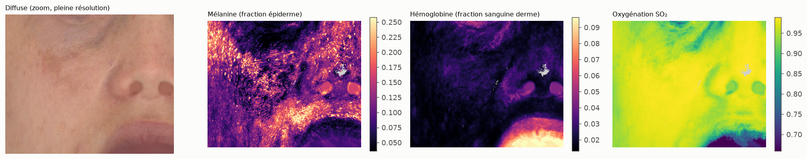

# Digital Emily : inversion et séparation du spéculaire

Données : `data/Emily/` (projet WikiHuman, USC ICT ; licence recherche). Textures UV 1280², étude à 512².

## 1. Espace colorimétrique

Texels (tous, cheveux et vêtements compris) dans le gamut peau : **76 %** lus comme linéaires,
44 % lus comme sRGB encodé. **La diffuse d'Emily est bien linéaire** (contrairement au fichier VFace).

Auto-calibration (exposition + balance R/B, `lut3d.autocalibrate`) : gains (R, G, B) = (0.745, 0.750, 0.709) ;
texels à moins de 0,03 du gamut peau : 59 % → 72 %. Le gain d'exposition (≈ ×0.75) est appliqué
dans la suite. Attention : une exposition globale et un teint globalement plus clair sont en partie confondus ;
ce gain doit être validé par un artiste ou une référence.

## 2. Cartes depuis la vraie diffuse (polarisation croisée)

Texels dans le gamut peau : 76 % (cheveux, yeux, bouche et vêtements exclus automatiquement en grande partie).
Médianes : mélanine 0.121, sang 0.0168, SO₂ 0.86.

## 3. Séparation du spéculaire (mixte synthétique = diffuse + k × spéculaire mesuré)

Méthode : retirer le plus petit blanc s ≥ 0 qui ramène la couleur sur le gamut de la peau mesurée
(tolérance 0.02 en RGB encodé). Erreurs relatives médianes sur les cartes, par rapport aux cartes de la vraie diffuse.

| k (échelle spéculaire) | spéculaire médian ajouté | ΔE00 mixte vs vraie | ΔE00 récupérée vs vraie (méd. / p95) | erreur mélanine sans / avec séparation | erreur sang sans / avec séparation | corrélation spéculaire estimé / vrai | % texels mixtes dans le gamut |
|---|---|---|---|---|---|---|---|
| 0.05 | 0.030 | 2.90 | 2.86 / 4.35 | 30 % / 30 % | 9 % / 9 % | 0.01 | 99 % |
| 0.1 | 0.061 | 5.44 | 5.37 / 7.63 | 50 % / 48 % | 17 % / 16 % | 0.13 | 97 % |
| 0.2 | 0.121 | 9.75 | 9.04 / 12.97 | 70 % / 66 % | 30 % / 24 % | 0.26 | 87 % |

Note : l'échelle absolue de la texture spéculaire est inconnue ; k couvre des niveaux de reflet faibles à forts.

## 4. Conclusions

1. **Auto-calibration nécessaire, et elle fonctionne.** La diffuse Light Stage est linéaire mais
   plus claire qu'un albédo absolu : sans correction, de grandes zones du front et des joues
   sortent du gamut peau. Un gain d'exposition ≈ ×0,75 (balance quasi neutre) ramène tout le
   visage dans le gamut. Limite connue : exposition et teint globalement plus clair sont en partie
   confondus. Le gain est une proposition à valider (référence ou artiste).
2. **La séparation du spéculaire depuis une seule image, par la couleur, ne fonctionne pas sur
   la peau.** Même à faible niveau (k = 0,05), 99 % des texels « diffuse + spéculaire » restent
   dans le gamut de la peau réelle : ajouter du blanc à une peau donne une autre peau plausible
   (plus claire, moins pigmentée). La corrélation entre spéculaire estimé et vrai est quasi nulle
   (0,01–0,26), et l'erreur sur la diffuse n'est pas réduite.
3. **Ce que coûte un spéculaire non retiré** : il part surtout dans la **mélanine** (erreur médiane
   30 %, 50 % et 70 % pour k = 0,05 / 0,1 / 0,2), moins dans le sang (9 %, 17 %, 30 %).
   → La polarisation croisée (ou un équivalent) n'est pas un luxe : c'est une condition pour des
   cartes de mélanine fiables.
4. **Pistes pour les captures sans polarisation croisée**, qui exploitent la géométrie et non la
   couleur :
   - **multi-vues** : le spéculaire se déplace avec le point de vue, pas la diffuse. Le minimum
     (ou un percentile bas) par texel sur toutes les vues de la photogrammétrie approche la
     diffuse. C'est la piste la plus prometteuse, les captures ayant de toute façon des dizaines de vues ;
   - **cohérence avec les normales et l'éclairage** : le spéculaire suit la géométrie (lobes
     alignés sur les normales), pas les chromophores ;
   - en dernier recours, un réseau entraîné sur des paires cross/parallèle (Light Stage).

## 5. Planche complète à pleine résolution (1280²)

`scripts/phase2/emily_maps.py` — diffuse calibrée (×0,75), LUT 65³, a priori visage.

Lecture :
- **Mélanine** : taches pigmentaires et zones brunes sous les yeux et sur les joues, bien
  détaillées (visibles dans le zoom).
- **Hémoglobine** : faible et homogène sur la peau ; élevée sur les lèvres, les paupières et les
  narines. L'intérieur de la bouche est très élevé, mais ce n'est pas de la peau : à masquer.
- **SO₂** : élevée et lisse (0,86 médiane), incertitude faible dans cette zone de l'a priori.
- **Épaisseur, ratio eu/phéo, diffusion** : leurs structures reflètent surtout des fuites de la
  couleur (mêmes contours que la mélanine) ; conformément à l'identifiabilité, ces cartes ne sont
  pas fiables depuis le RGB et doivent rester lisses et peignables.
- **Hors peau** : une partie des cheveux bruns tombe dans le gamut (confondue avec une peau très
  pigmentée) ; un masque cheveux/yeux/bouche est nécessaire.
