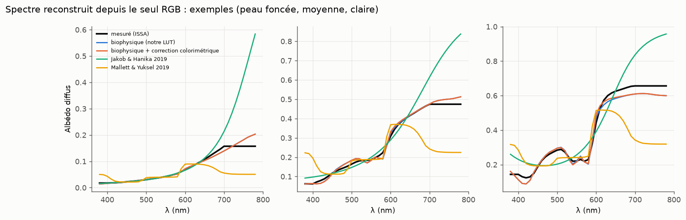
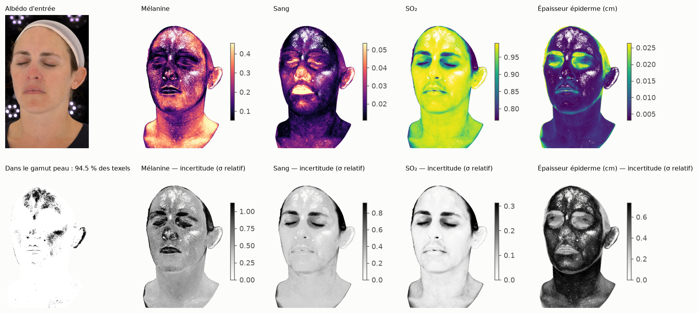

# Phase 2 — Inversion RGB → chromophores : bilan d'étape

Date : 2026-09-25. Cadre : [ADR-0003](../adr/0003-inversion-rgb-lut3d-a-priori.md),
modèle direct calibré ([ADR-0007](../adr/0007-calibration-fond-mesures.md)). Rapports :
[V3 (LUT 33³)](V3_inversion.md), [V3 (LUT 65³)](V3_inversion_65.md).

## 1. Livrables

| Livrable | Fichier | Remarques |
|---|---|---|
| Inversion MAP + Laplace | `chromophores/inversion.py` | 6 paramètres en espace non borné ; a priori gaussiens pleins ; `colour_exact` (correction colorimétrique lisse à 3 coefficients) |
| Ajustements de population | `data/derived/{issa,nist}_fits.npz` | 2 821 spectres ISSA (8 groupes × 12 zones), 100 NIST (400–1000 nm) ; `scripts/phase2/fit_population.py` |
| A priori | `chromophores/data/priors_v1.npz` | population, par groupe ethnique, par région (front, joue, menton, nez, visage, corps) ; diffusion tirée de NIST |
| LUT 3D | `chromophores/lut3d.py`, `data/rgb_lut[_face][_65]_v1.npz` | Grille sur sRGB encodé, restreinte au gamut peau mesuré (1 348 nœuds en 33³, 10 675 en 65³), MAP + σ + ΔE par nœud ; 2 min (33³) / 12 min (65³) sur 4 cœurs |
| Cartes de chromophores | `scripts/phase2/apply_textures.py` | Testé sur les 2 albédos d'exemple de BioSkin |

## 2. Résultats (300 spectres ISSA non utilisés pour l'a priori)

### Ce que le RGB permet de retrouver (vs ajustement du spectre complet)

| Paramètre | Corrélation RGB / spectre | Incertitude bien calibrée (% \|z\| < 2) |
|---|---|---|
| Mélanine | 0,84 | 97 % |
| Sang | 0,79 | 92 % |
| SO₂ | 0,60 | 100 % |
| Épaisseur de l'épiderme | 0,53 | 99 % |
| Ratio eu/phéo | 0,49 | 100 % |
| Échelle de diffusion | 0,08 | 70 % |

Sur des données réelles, on retrouve exactement ce que prédisait l'analyse
d'identifiabilité : le RGB contraint la mélanine et le sang, un peu le SO₂ et
l'épaisseur, pas du tout la diffusion. Les incertitudes annoncées sont honnêtes.

### Spectre reconstruit depuis le seul RGB (question clé pour un moteur spectral)

| Méthode | RMS spectral médian | ΔE00 D65 | ΔE00 A | ΔE00 FL11 | ΔE00 LED-B3 |
|---|---|---|---|---|---|
| **Biophysique + correction colorimétrique** | **0,0094** | **0,00** | **0,36** | **0,66** | **0,28** |
| Biophysique seule | 0,0094 | 0,39 | 0,51 | 0,71 | 0,43 |
| Jakob & Hanika 2019 | 0,0345 | 0,03 | 1,42 | 2,68 | 1,36 |
| Mallett & Yuksel 2019 | 0,0650 | 0,10 | 1,38 | 1,06 | 0,74 |

(médianes ; p95 dans les rapports.) L'uplift biophysique donne des spectres de peau
**3,7 à 7 fois plus proches de la mesure** que les méthodes génériques. Avec la
correction colorimétrique, il reproduit exactement la couleur de capture et reste le
meilleur sous tungstène, fluo et LED. Pour un moteur spectral, c'est l'argument central
du projet, désormais mesuré sur de vraies peaux.

### Critères V3 (ADR-0005)

| Critère | Résultat | Statut |
|---|---|---|
| LUT vs optimisation directe < 1 % (paramètres identifiables) | 65³ : mélanine 0,97 %, sang 1,36 % (médianes) ; p95 8 % / 6 % ; **0,016 σ** en médiane | ⚠️ limite (mélanine OK, sang juste au-dessus ; négligeable devant l'incertitude) |
| Reconstruction ΔE00 < 1 | MAP seul : médiane 0,39, p95 1,44 ; **avec correction : 0,00** | ✅ avec correction colorimétrique |
| Spectres plausibles | RMS spectral médian 0,0094 contre des spectres réels | ✅ (test plus exigeant que l'enveloppe NIST) |

Comme pour V2, un critère en pourcentage est mal posé : l'écart LUT / optimisation doit
se juger **en unités d'incertitude a posteriori** (0,016 σ en médiane). Proposition à
consigner dans un futur ADR si tu es d'accord.

## 3. Cartes sur textures réelles

- Structure plausible : sang élevé sur les lèvres, le nez et les pommettes, SO₂ élevé
  et homogène ; 94,5 % des texels dans le gamut peau.
- **Défaut attendu et bien visible** : l'ombrage résiduel (cou, dessous du menton,
  orbites) est interprété comme de la mélanine (« gain nuisible », voir PRODUCTION §3.3).
- Les reflets résiduels (front) sortent du gamut et sont signalés, pas inventés.

## 4. Enseignements

1. **β (ratio eu/phéo) n'est pas interprétable physiquement** dans le modèle actuel :
   les ajustements le poussent vers la phéomélanine (médiane 0,09 ; ≈ 0 sur NIST). Il
   sert de « pente spectrale de la mélanine » et compense un défaut de forme. C'est un
   a priori empirique valide, mais pas un ratio biologique.
2. Les **a priori par région** sont cohérents avec la physiologie : sang
   visage ≈ 3× corps, maximum au menton.
3. Les spectres ISSA au-delà de 700 nm sont extrapolés à valeur constante (tiers des
   données seulement) : les comparaisons spectrales portent sur 400–700 nm.

## 5. Reste à faire (phase 2)

| Élément (ADR-0003) | État |
|---|---|
| Gain / occlusion résiduelle (marginalisation, ou division par une AO issue du déplacement) | **Prioritaire** : visible sur les cartes |
| Modèle caméra : calibration orientée peau à partir des spectres ISSA réels, ou sensibilités spectrales | À faire (LUT actuelle : sRGB linéaire idéal) |
| Régularisation spatiale (mélanine nette, sang diffus) | À faire |
| LUT par région (masques VFace) | Mécanique prête (a priori par région) ; manque une texture VFace |
| Test sur un albédo VFace réel | En attente d'un fichier |
