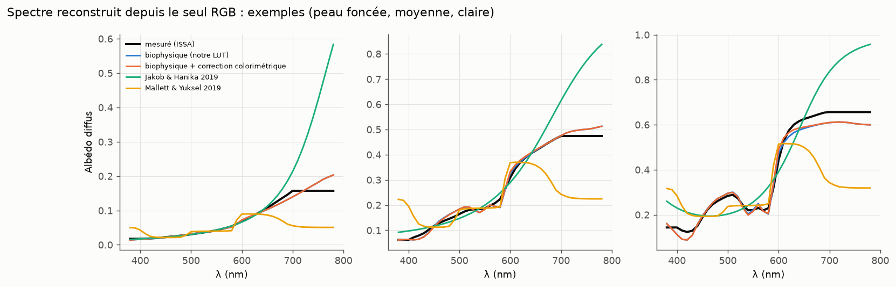
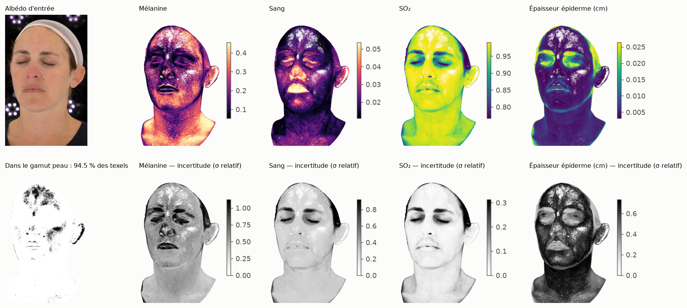

# Phase 2 — Inversion RGB → chromophores : bilan d'étape

Date : 2026-09-25. Cadre : [ADR-0003](../adr/0003-inversion-rgb-lut3d-a-priori.md),
modèle direct calibré ([ADR-0007](../adr/0007-calibration-fond-mesures.md)). Rapports :
[V3 (LUT 33³)](V3_inversion.md), [V3 (LUT 65³)](V3_inversion_65.md).

## 1. Livrables

| Livrable | Fichier | Remarques |
|---|---|---|
| Inversion MAP + Laplace | `chromophores/inversion.py` | 6 paramètres en espace non borné ; a priori gaussiens pleins ; `colour_exact` (correction colorimétrique lisse à 3 coefficients) |
| Ajustements de population | `data/derived/{issa,nist}_fits.npz` | 2 821 spectres ISSA (8 groupes × 12 zones), 100 NIST (400–1000 nm) ; `scripts/phase2/fit_population.py` |
| A priori | `chromophores/data/priors_v1.npz` | population, par groupe ethnique, par région (front, joue, menton, nez, visage, corps) ; diffusion tirée de NIST |
| LUT 3D | `chromophores/lut3d.py`, `data/rgb_lut[_face][_65]_v1.npz` | Grille sur sRGB encodé, restreinte au gamut peau mesuré (1 348 nœuds en 33³, 10 675 en 65³), MAP + σ + ΔE par nœud ; 2 min (33³) / 12 min (65³) sur 4 cœurs |
| Cartes de chromophores | `scripts/phase2/apply_textures.py` | Testé sur les 2 albédos d'exemple de BioSkin |

## 2. Résultats (300 spectres ISSA non utilisés pour l'a priori)

### Ce que le RGB permet de retrouver (vs ajustement du spectre complet)

| Paramètre | Corrélation RGB / spectre | Incertitude bien calibrée (% \|z\| < 2) |
|---|---|---|
| Mélanine | 0,84 | 97 % |
| Sang | 0,79 | 92 % |
| SO₂ | 0,60 | 100 % |
| Épaisseur de l'épiderme | 0,53 | 99 % |
| Ratio eu/phéo | 0,49 | 100 % |
| Échelle de diffusion | 0,08 | 70 % |

Sur des données réelles, on retrouve exactement ce que prédisait l'analyse
d'identifiabilité : le RGB contraint la mélanine et le sang, un peu le SO₂ et
l'épaisseur, pas du tout la diffusion. Les incertitudes annoncées sont honnêtes.

### Spectre reconstruit depuis le seul RGB (question clé pour un moteur spectral)

| Méthode | RMS spectral médian | ΔE00 D65 | ΔE00 A | ΔE00 FL11 | ΔE00 LED-B3 |
|---|---|---|---|---|---|
| **Biophysique + correction colorimétrique** | **0,0094** | **0,00** | **0,36** | **0,66** | **0,28** |
| Biophysique seule | 0,0094 | 0,39 | 0,51 | 0,71 | 0,43 |
| Jakob & Hanika 2019 | 0,0345 | 0,03 | 1,42 | 2,68 | 1,36 |
| Mallett & Yuksel 2019 | 0,0650 | 0,10 | 1,38 | 1,06 | 0,74 |

(médianes ; p95 dans les rapports.) L'uplift biophysique donne des spectres de peau
**3,7 à 7 fois plus proches de la mesure** que les méthodes génériques. Avec la
correction colorimétrique, il reproduit exactement la couleur de capture et reste le
meilleur sous tungstène, fluo et LED. Pour un moteur spectral, c'est l'argument central
du projet, désormais mesuré sur de vraies peaux.

### Critères V3 (ADR-0005)

| Critère | Résultat | Statut |
|---|---|---|
| LUT vs optimisation directe < 1 % (paramètres identifiables) | 65³ : mélanine 0,97 %, sang 1,36 % (médianes) ; p95 8 % / 6 % ; **0,016 σ** en médiane | ⚠️ limite (mélanine OK, sang juste au-dessus ; négligeable devant l'incertitude) |
| Reconstruction ΔE00 < 1 | MAP seul : médiane 0,39, p95 1,44 ; **avec correction : 0,00** | ✅ avec correction colorimétrique |
| Spectres plausibles | RMS spectral médian 0,0094 contre des spectres réels | ✅ (test plus exigeant que l'enveloppe NIST) |

Comme pour V2, un critère en pourcentage est mal posé : l'écart LUT / optimisation doit
se juger **en unités d'incertitude a posteriori** (0,016 σ en médiane). Proposition à
consigner dans un futur ADR si tu es d'accord.

## 3. Cartes sur textures réelles

- Structure plausible : sang élevé sur les lèvres, le nez et les pommettes, SO₂ élevé
  et homogène ; 94,5 % des texels dans le gamut peau.
- **Défaut attendu et bien visible** : l'ombrage résiduel (cou, dessous du menton,
  orbites) est interprété comme de la mélanine (« gain nuisible », voir PRODUCTION §3.3).
- Les reflets résiduels (front) sortent du gamut et sont signalés, pas inventés.

## 4. Enseignements

1. **β (ratio eu/phéo) n'est pas interprétable physiquement** dans le modèle actuel :
   les ajustements le poussent vers la phéomélanine (médiane 0,09 ; ≈ 0 sur NIST). Il
   sert de « pente spectrale de la mélanine » et compense un défaut de forme. C'est un
   a priori empirique valide, mais pas un ratio biologique.
2. Les **a priori par région** sont cohérents avec la physiologie : sang
   visage ≈ 3× corps, maximum au menton.
3. Les spectres ISSA au-delà de 700 nm sont extrapolés à valeur constante (tiers des
   données seulement) : les comparaisons spectrales portent sur 400–700 nm.

## 4 bis. Premier albédo de production (VFace)

Voir [VFACE_1001](VFACE_1001.md) :
- l'auto-calibration détecte que le fichier « lin_srgb » est en réalité encodé en sRGB
  (7 % contre 99,7 % de texels dans le gamut peau) ;
- les cartes gardent le détail à pleine résolution (plaques de couperose dans la carte de sang) ;
- le résidu du modèle seul vaut 0,34 ΔE00 en médiane (1,45 au p95), concentré sur les
  oreilles, les lèvres et les zones de remplissage ;
- une diaphonie mélanine/sang est visible dans les rougeurs : c'est le prochain correctif
  (régularisation spatiale).

## 4 ter. Digital Emily (Light Stage, polarisation croisée)

Voir [EMILY](EMILY.md) :
- **auto-calibration** (`lut3d.autocalibrate`, exposition + balance R/B) : Emily ×0,75, VFace ×0,77 ;
  elle ramène la diffuse dans le gamut peau (à valider par un artiste, car exposition et teint
  sont en partie confondus) ;
- **la séparation du spéculaire par la couleur, sur une seule image, échoue sur la peau** : un
  spéculaire ajouté ressemble à « moins de mélanine » (99 % des texels restent plausibles). Non
  retiré, il fausse la mélanine de 30 à 70 %. Sans polarisation croisée, il faudra des indices
  géométriques (multi-vues, normales).

## 4 quater. Benchmark contre BioSkin (Aliaga et al. 2023)

Voir [BENCHMARK_BIOSKIN](BENCHMARK_BIOSKIN.md). Sur des spectres mesurés : nos spectres sont
1,6× plus proches de la mesure et nos couleurs meilleures sous tous les éclairages. Sur la
fermeture de l'albédo d'Emily : égalité (médiane 0,73 contre 0,85). Une texture sRGB D65 donnée
telle quelle à BioSkin crée un biais de ~5 ΔE00 (convention couleur interne différente), ce qui
explique probablement la dérive observée avec l'ancien pipeline.

## 5. Clôture (2026-09-28)

Voir [CLOTURE](CLOTURE.md) : pipeline de production `chromophores/pipeline.py`
(`process_albedo` → `export`), cartes EXR d'Emily et de VFace dans `exports/`.

- **Masque non-peau** : gamut peau + distance de Mahalanobis à l'a priori ; en pratique le gamut
  fait tout le travail (cheveux, yeux, bouche).
- **Diaphonie mélanine / sang** : causée surtout par une **constante de phéomélanine 10 fois trop
  faible** (Donner & Jensen 2006 donnent des mm⁻¹, recopiés en cm⁻¹ ; trouvé en comparant avec le
  moteur Opus, voir [PHEO_CHECK](PHEO_CHECK.md)). Corrigée le 2026-09-30 : corrélation à l'échelle
  des plaques de −0,49 à +0,21 (VFace), de −0,57 à −0,29 (Emily). La mélanine ajustée devient
  plausible (a priori visage 2,4 % au lieu de 18 %). Les rapports V3, VFace, Emily et BioSkin
  sont antérieurs à la correction.
- **Régularisation** : limitée aux paramètres mal contraints (eu/phéo, SO₂, épaisseur),
  mélanine et sang gardés au MAP pour préserver tout le détail.
- **Bords de LUT** : traités par le résidu couleur (fermeture exacte à la précision machine) et
  le masque de gamut.
- **Diffusion** : non identifiable ; utiliser une constante en production.

## 6. Reporté après la phase 2

| Élément | Raison / piste |
|---|---|
| Gain / occlusion résiduelle | Nécessite une AO issue du déplacement, ou une marginalisation du gain |
| Modèle caméra (sensibilités spectrales) | Pas de données caméra ; LUT en sRGB linéaire idéal |
| Séparation du spéculaire sans polarisation croisée | La séparation par la couleur est invalidée ; indices géométriques (multi-vues) |
| Diaphonie mélanine / sang résiduelle (Emily) | À surveiller ; validation multispectrale |
| LUT par région (masques VFace) | Mécanique prête ; pas de masques de région fournis |
