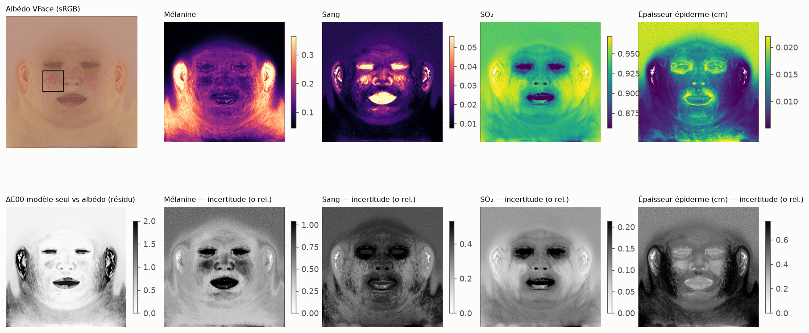
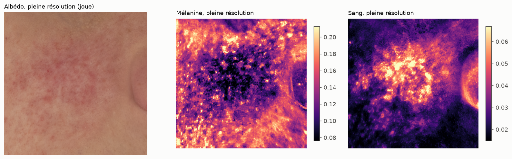

# VFace UDIM 1001 : inversion sur un albédo de production

Fichier : `data/VFace/XYZ_albedo_lin_srgb.1001.png` (4096², RGBA 8 bits, alpha constant).

## 1. Espace colorimétrique (auto-calibration)

| Interprétation | Texels dans le gamut peau mesuré (ISSA + NIST) | Distance médiane (encodé) | RGB linéaire médian |
|---|---|---|---|
| lu comme linéaire (nom du fichier) | 7.4 % | 0.153 | (0.722, 0.553, 0.439) |
| lu comme sRGB encodé | 99.7 % | 0.004 | (0.479, 0.266, 0.162) |

Référence ISSA + NIST : RGB linéaire médian (0,374 ; 0,209 ; 0,132), p95 (0,487 ; 0,313 ; 0,223).
**Malgré son nom, le fichier est encodé en sRGB (gamma)** : lu comme linéaire, il est hors du gamut
de la peau réelle pour 93 % des texels.

## 2. Cartes (LUT 65³, a priori « visage »), sur 1024²

- Texels dans le gamut peau : 99.7 %.
- Médianes : mélanine 0.1532, sang 0.0147, SO₂ 0.94,
  épaisseur épiderme 0.0127 cm, échelle μs′ 1.06 (a priori).

## 3. Détail à pleine résolution

## 4. Fermeture : albédo re-rendu par le modèle seul (sans résidu)

ΔE00 (D65) entre l'albédo d'entrée et l'albédo recalculé à partir des chromophores :
médiane 0.34, p95 1.45, max 5.19.
C'est l'amplitude du résidu (correction colorimétrique) nécessaire pour une reconstruction exacte.

## 5. Lecture

- **Détail conservé à pleine résolution** : la carte de sang reproduit fidèlement les plaques de
  rougeur (couperose) et les petits points vasculaires de la joue.
- **Diaphonie mélanine / sang** : dans les zones de rougeur, la carte de mélanine *baisse* là où
  le sang monte. Depuis le RGB, « plus de sang » et « moins de mélanine » donnent des couleurs
  voisines ; l'inversion texel par texel répartit l'ambiguïté entre les deux. Une partie du
  « détail » de mélanine sur la joue est donc un reflet inversé du sang. Correctif prévu :
  régularisation spatiale (statistiques spatiales différentes pour la mélanine et le sang) et
  covariance mélanine–sang dans l'a priori.
- **Résidu faible sur la peau** (≈ 0,3 ΔE00 médian). Il est élevé sur les **oreilles** (albédo
  plus orangé, probablement de la translucidité ou de la lumière transmise figée dans la texture),
  les **lèvres** et les **zones de remplissage** (intérieur des yeux et de la bouche, gris uni) :
  ce sont les régions à traiter par masque ou par a priori régional.
- **Cou et bas de texture** : mélanine plus élevée (albédo plus jaune). À confirmer : bronzage
  réel, ou dérive de l'éclairage de capture.
