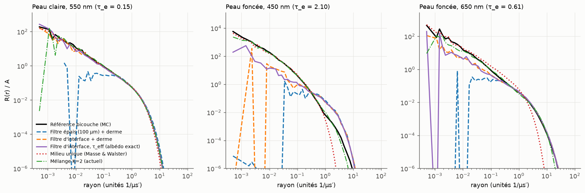

# Faisabilité ADR-0008 : épiderme en filtre d'interface

Script : `scripts/phase3/filter_feasibility.py` (200,000 photons par simulation). Référence : Monte Carlo
bicouche (épiderme 100 µm, sang 2 %, SO₂ 75 %, même diffusion dans les deux couches). Métrique de
forme : RMSE du log-profil pondérée par l'énergie (ADR-0006), à comparer au plancher de bruit.

| Méthode | RMSE forme − plancher (médiane / max) | \|ΔA\| (médiane / max) |
|---|---|---|
| Filtre épais (100 µm, non diffusant) + derme | 1.086 / 11.430 | 15.6% / 80.1% |
| Filtre d'interface (épaisseur nulle) + derme | 0.153 / 9.102 | 15.8% / 80.2% |
| Filtre d'interface, τ_eff ajusté sur l'albédo | 0.140 / 1.877 | 0.5% / 5.5% |
| Milieu unique (albédo imposé) | 0.466 / 2.313 | 0 (imposé) |
| Mélange K=2 | 0.246 / 1.931 | 0.4% / 1.3% |

| Peau | λ | τ_e | A réf. | Plancher de bruit | Filtre épais : RMSE forme | Filtre épais : ΔA | Filtre d'interface : RMSE forme | Filtre d'interface : ΔA | Filtre τ_eff : RMSE forme | τ_eff / τ_e | Milieu unique : RMSE forme | Milieu unique : ⟨r⟩ / réf. | K=2 : RMSE forme | K=2 : ΔA |
|---|---|---|---|---|---|---|---|---|---|---|---|---|---|---|
| très claire | 450 | 0.080 | 0.195 | 0.007 | 0.678 | -25.5% | 0.087 | -25.6% | 0.038 | 0.00 | 0.035 | 1.00 | 0.339 | +0.2% |
| très claire | 550 | 0.040 | 0.231 | 0.008 | 0.453 | -18.5% | 0.077 | -18.5% | 0.047 | 0.00 | 0.048 | 1.03 | 0.244 | -0.2% |
| très claire | 650 | 0.023 | 0.525 | 0.006 | 0.257 | -1.2% | 0.024 | -1.3% | 0.028 | 0.91 | 0.094 | 0.93 | 0.262 | +0.6% |
| claire | 450 | 0.289 | 0.102 | 0.009 | 1.121 | -17.3% | 0.180 | -17.2% | 0.166 | 0.75 | 0.234 | 0.85 | 0.059 | +0.0% |
| claire | 550 | 0.146 | 0.156 | 0.009 | 1.068 | -11.6% | 0.077 | -11.7% | 0.067 | 0.70 | 0.138 | 0.90 | 0.292 | -0.1% |
| claire | 650 | 0.084 | 0.390 | 0.006 | 0.358 | +3.5% | 0.053 | +3.4% | 0.046 | 1.09 | 0.343 | 0.79 | 0.137 | -0.5% |
| mate | 450 | 0.846 | 0.032 | 0.015 | 3.858 | -23.1% | 0.733 | -23.0% | 0.706 | 0.85 | 0.998 | 0.56 | 1.248 | +0.1% |
| mate | 550 | 0.430 | 0.071 | 0.010 | 2.454 | -3.4% | 0.314 | -3.7% | 0.300 | 0.95 | 0.606 | 0.67 | 0.092 | -1.3% |
| mate | 650 | 0.245 | 0.214 | 0.006 | 1.000 | +13.6% | 0.141 | +13.6% | 0.128 | 1.21 | 0.955 | 0.60 | 0.118 | -0.2% |
| foncée | 450 | 2.098 | 0.008 | 0.023 | 11.453 | -80.1% | 9.125 | -80.2% | 1.901 | 0.65 | 1.060 | 0.62 | 0.203 | +1.3% |
| foncée | 550 | 1.067 | 0.020 | 0.022 | 5.175 | -13.9% | 0.955 | -14.3% | 0.976 | 0.92 | 1.857 | 0.38 | 1.953 | -0.8% |
| foncée | 650 | 0.609 | 0.080 | 0.011 | 2.430 | +25.5% | 0.363 | +25.4% | 0.541 | 1.16 | 2.324 | 0.36 | 0.266 | -1.0% |

## Constats

1. **Un épiderme non diffusant de 100 µm est exclu** : il crée un trou dans le profil en champ
   proche (plus aucune diffusion dans les 100 premiers µm).
2. **Le filtre d'interface (épaisseur nulle) a une bonne forme mais un albédo faux** (±15 à 25 %,
   −80 % sur peau foncée dans le bleu). Deux effets de signes opposés : les trajets obliques
   traversent le filtre sur une longueur d/|cos θ| (le filtre absorbe trop), et dans la vraie peau la
   mélanine agit aussi sur les photons qui diffusent plusieurs fois dans l'épiderme (le filtre
   absorbe trop peu dans le rouge).
3. **Avec une épaisseur optique effective τ_eff ajustée sur l'albédo**, le filtre bat le mélange
   K=2 en médiane (0,14 contre 0,25 au-dessus du bruit). Il est proche du plancher de bruit sur les
   peaux claires, en particulier dans le rouge, où la diffusion se voit (0,03–0,05 contre
   0,14–0,26). Il est moins bon sur peau foncée (bleu et rouge) : l'épiderme pigmenté produit un pic
   de diffusion simple en champ proche qu'aucun filtre ne peut reproduire. τ_eff / τ_e va de 0,65
   à 1,2. Sur peau très claire dans le bleu, aucun τ_eff ≥ 0 ne suffit : l'épiderme presque sans
   mélanine absorbe *moins* que le derme sanguin, et le filtre ne peut pas représenter une couche
   plus claire que ce qu'elle recouvre (écart d'albédo résiduel de 3 à 5 %).
4. **Le milieu unique (Masse & Walster)** est excellent sur peau très claire, mais comprime le
   profil sur peau mate ou foncée (⟨r⟩ × 0,36 à 0,67) : la peau foncée devient trop opaque.
5. **Aucune méthode ne passe le critère V2** (écart au plancher < 0,05). La RMSE du log-profil
   n'est pas une mesure visuelle : l'arbitrage doit se faire sur un test d'image (ADR-0008).
